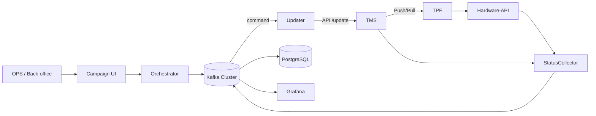

# Dossier d’Architecture – Plateforme de Mise à Jour TPE / TMS

> **Version 1.0 – 20 juillet 2025**\
> Auteur : Équipe Architecture Solutions

---

## 1. Contexte et objectifs


---

## 3. Vue d’ensemble (C4 – Niveau Contexte)



---

## 4. Composants principaux

| Composant                 | Responsabilité                                                                                      | Technos suggérées     |
| ------------------------- | --------------------------------------------------------------------------------------------------- | --------------------- |
| **Campaign‑Orchestrator** | UI + API REST pour créer/annuler une campagne ; publie les commandes Kafka                          | Spring Boot / FastAPI |
| **Kafka Cluster**         | Bus d’événements (KRaft, RF = 3)                                                                    | Apache Kafka 3.7      |
| **Updater Workers**       | Consomme `tpe.update.command`, appelle l’API TMS, publie état initial                               | Go / Java Vert.x      |
| **Status‑Collector**      | Poll intensif puis décroissant (API TMS & Hardware‑API) ; publie statuts terminaux ; alimente la BD | Kotlin + Reactor      |
| **Metadata‑Collector**    | Snapshots périodiques des versions réelles                                                          | Airflow DAG           |
| **PostgreSQL**            | Tables `tpe`, `campaign`, `campaign_tpe`                                                            | CloudSQL / Aurora     |
| **Observabilité**         | Prometheus + Grafana + Loki                                                                         | Helm stack            |

---

## 5. Design Kafka

### 5.1 Topics

| Topic                  | Type         | Clé          | Partitions | Retention             | Usage                 |                |
| ---------------------- | ------------ | ------------ | ---------- | --------------------- | --------------------- | -------------- |
| `tpe.update.command`   | Log          | \`campaignId | tpeId\`    | ≥ 12                  | 7 jours               | Ordres de MAJ  |
| `tpe.update.status`    | Log compacté | \`campaignId | tpeId\`    | ≥ 12                  | 90 jours + compaction | Journal d’état |
| `tpe.version.snapshot` | Log compacté | `tpeId`      | ≥ 12       | 30 jours + compaction | Inventaire périodique |                |
| `tpe.events.dlq`       | Log          | -            | 6 mois     | 6 mois                | Messages invalides    |                |

### 5.2 Filtrage des statuts finaux (JDBC Sink)

```properties
transforms=KeepFinal
transforms.KeepFinal.type=org.apache.kafka.connect.transforms.Filter
transforms.KeepFinal.predicate=IsFinal
predicates.IsFinal.type=org.apache.kafka.connect.transforms.predicates.ValueFieldName
predicates.IsFinal.field=status
predicates.IsFinal.pattern=SUCCESS|FAILED|TIMEOUT
```

---

## 6. Stratégie de polling

| Tentative | Âge campagne | Intervalle     | Rationale      |
| --------- | ------------ | -------------- | -------------- |
| 1 – 12    | 0–60 min     | 5 min          | Fenêtre chaude |
| 13 – 24   | 1–6 h        | 15 min         | Décroissance   |
| 25 – 48   | 6–24 h       | 1 h            | Froid          |
| >48       | >24 h        | Stop & Timeout | Clôture        |

Algorithme DelayQueue (Go pseudo‑code) :

```go
if attempt <= 12 { return 5 * time.Minute }
if attempt <= 24 { return 15 * time.Minute }
if attempt <= 48 { return 60 * time.Minute }
return 0 // stop
```

---

## 7. Modèle de données SQL

```sql
CREATE TABLE tpe (
  tpe_id UUID PRIMARY KEY,
  id_tms VARCHAR NOT NULL,
  version_courante VARCHAR,
  statut VARCHAR(8),
  last_seen TIMESTAMP,
  metadata JSONB
);

CREATE TABLE campaign (
  campaign_id UUID PRIMARY KEY,
  version_cible VARCHAR NOT NULL,
  created_at TIMESTAMP,
  status VARCHAR(10)
);

CREATE TABLE campaign_tpe (
  campaign_id UUID REFERENCES campaign,
  tpe_id UUID REFERENCES tpe,
  status VARCHAR(10),
  last_update TIMESTAMP,
  PRIMARY KEY (campaign_id, tpe_id)
);
```

---

## 8. Observabilité & Alerting

- **Prometheus metrics** : `tms_requests_total`, `update_duration_seconds` (histogram), `campaign_progress{status}`.
- **Grafana dashboards** :
  - Gauge progression campagne.
  - Heat‑map durée d’installation.
  - Table des échecs récents.
- **Alertes** : SLA >5 % FAILED ou aucune progression en 30 min.

---

## 9. Patterns appliqués

| Pattern                   | Implémentation SI                  | Référence                 |
| ------------------------- | ---------------------------------- | ------------------------- |
| **Command Message**       | `tpe.update.command`               | Hohpe & Woolf, *EIP*      |
| **Competing Consumers**   | Updater workers                    | EIP                       |
| **Saga (orchestrée)**     | Campaign‑Orchestrator + status bus | microservices.io          |
| **Outbox**                | Status‑Collector (DB + topic)      | Chris Richardson          |
| **CQRS / Event Sourcing** | Tables SQL ↔ topics Kafka          | Azure Architecture Center |
| **DLQ**                   | `tpe.events.dlq`                   | EIP                       |

Exemples d’entreprises : **BMW Group** (OTA), **Walmart** (IoT / replenishment) – études de cas Confluent & Kafka Summit.

---

## 10. Vertus & Quality Attributes

| Vertu           | Mécanisme                      | Mesure                   |
| --------------- | ------------------------------ | ------------------------ |
| Scalabilité     | Partitionnement Kafka + HPA    | ≥ 1 000 msg/s par nœud   |
| Résilience      | Replication factor 3 + retries | 0 perte message, RPO 0 s |
| Observabilité   | Exporters Prometheus + Loki    | MTTR < 15 min            |
| Couplage faible | Topics vs API TMS direct       | Plug & play second TMS   |
| Audit           | Historique compacté + BI       | Trails 90 jours          |

---

## 11. Checklist Comité d’Architecture

-

---

## 12. Glossaire

| Terme            | Définition                                  |
| ---------------- | ------------------------------------------- |
| **TPE**          | Terminal de Paiement Électronique (Android) |
| **TMS**          | Terminal Management System du fournisseur   |
| **Hardware‑API** | API interne exposée par le TPE              |
| **Campaign**     | Lot de MAJ adressé à un ensemble de TPE     |
| **Snapshot**     | Photo périodique des versions réelles       |

---

© 2025 – Reproduction interdite sans autorisation


1. Vertus clés de l’architecture proposée
Axe de valeur	Vertu	Pourquoi c’est important pour le projet TPE/TMS
Scalabilité & Débit	Elasticité horizontale des workers Kafka ; partitionnement par tpeId	Garantit le traitement parallèle de 3 000 TPE (ou 30 000 demain) sans refonte ni arrêt de service.
Résilience & Fiabilité	Exactly-once, DLQ, Back-off exponentiel, réplique ×3	Absorbe les pannes TMS, réseaux intermittents des TPE et évite la “mise à jour cassée” qui coûte cher en support.
Observabilité & Traçabilité	Événements structurés + métriques Prometheus + logs Loki	Permet un tableau de bord temps-réel, une analyse post-mortem précise et la preuve d’audit (PCI-DSS, RGPD).
Agilité & Évolutivité fonctionnelle	Séparation Command / Event (CQRS, Saga)	Ajout d’un moteur ML (prédiction d’échec) ou d’un second TMS → simple abonnement au topic, sans toucher au code existant.
Souveraineté et Couplage faible	Les règles de ciblage résident dans le SI, pas chez le fournisseur TMS	On garde la maîtrise du rythme et des règles métiers, on peut changer de TMS ou en intégrer plusieurs.
Time-to-Market OPS	UI Orchestrator + bus d’événements	L’équipe OPS lance, surveille et arrête une campagne en quelques clics, sans script manuel ni fenêtre de maintenance.
Coût total maîtrisé	Kafka ≈ disque + CPU (open source) ; composants stateless	Pas de licence propriétaire pour l’orchestration ; dimensionnement à la demande (HPA, autoscaling).
2. Comment mettre en avant ces vertus dans un dossier d’architecture
Section du dossier	Conseils de valorisation
Résumé exécutif (1 page)	• Tableau synthétique “Problème ➞ Solution ➞ Bénéfice”
• Chiffre fort : « < 3 s pour déclencher 3 000 MAJ » ou « 99,99 % disponibilité visée ».
Objectifs & Exigences non fonctionnelles	Trace chaque vertu vers un Quality Attribute Scenario (ATAM)
Ex. Scalability: « Quand 2× plus de TPE, le débit reste ≥ 1 000 msg/s avec +1 nœud ».
Vue logique (4+1)	Identifie explicitement les patterns (Command, Saga, DLQ…) sur le diagramme ; ajoute une legend box “Patterns EIP” pour montrer l’alignement aux bonnes pratiques.
Vue de déploiement	Montre le scaling factor (nb. partitions ↔ workers) ; annexe la formule de capacity planning utilisée (msg/s = N TPE / durée max).
Matrix Qualité ↔ Composant	Petite matrice 6 × 6 listant : composant, vertu couverte, métrique, seuil, mécanisme (ex. Prometheus alert).
Preuve par le POC	— Capture Grafana : latence 50ᵉ percentile
— Logs Loki d’un TPE en échec ➞ relance automatique
— Replay d’événement démontrant l’exactly-once.
Analyse de risque / trade-offs	Utilise le format ADR (“Décision : bus Kafka Vs file MQ classique ; Contexte ; Conséquences ; Vertus obtenues”).
Estimations coût & ROI	Tableau cloud : coût stockage Kafka, CPU HPA, Vs coût heures-homme support évité grâce à l’automatisation et au monitoring.
Annexes références	Liste les cas BMW, Walmart, ING (liens + résumé) pour rassurer la gouvernance que le design est “battle-tested”.
